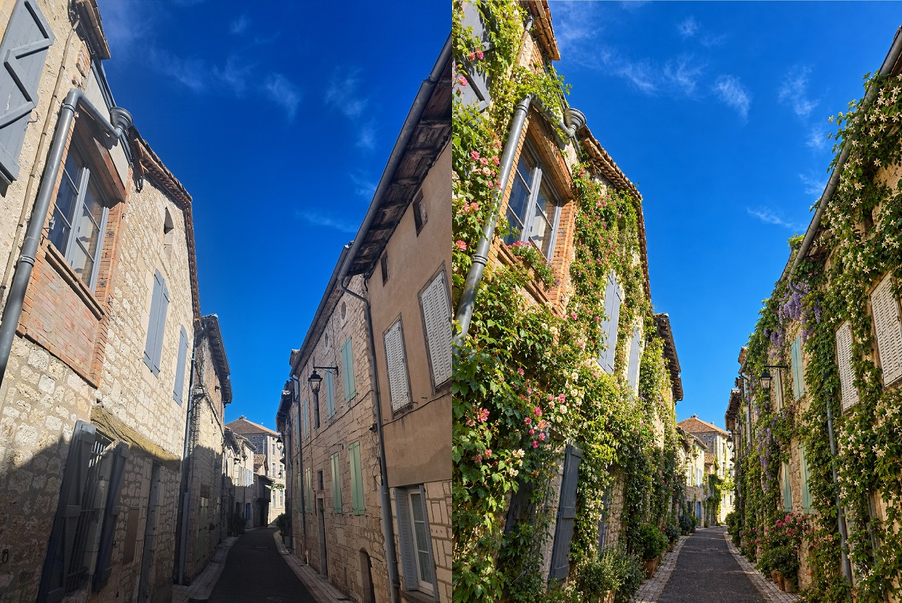
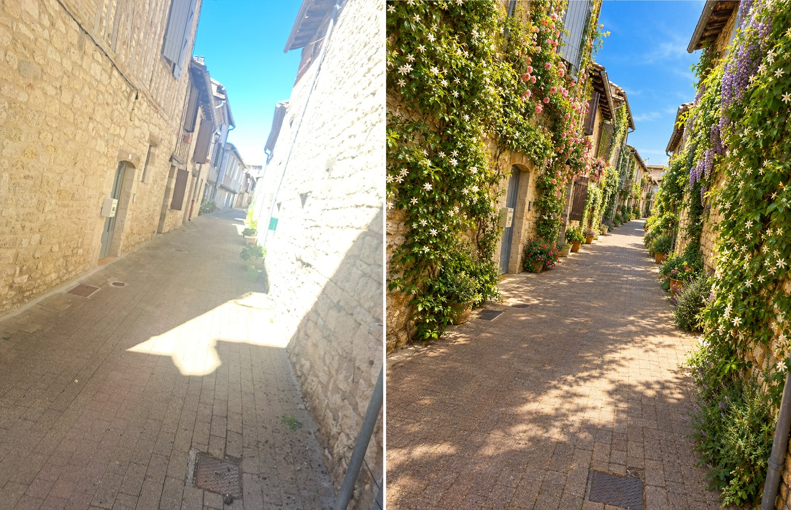
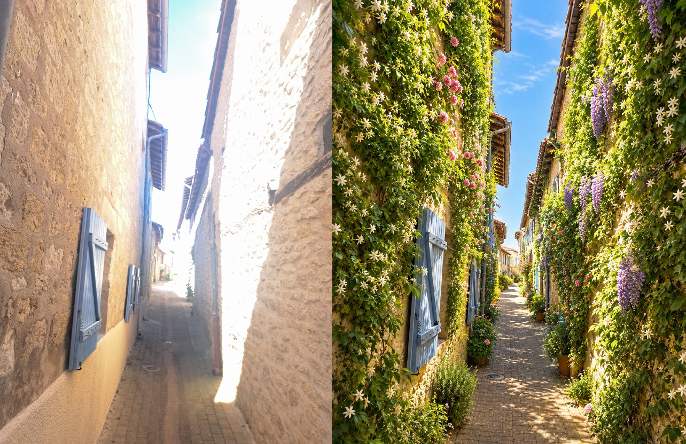

## Végétalisation de Montpezat de Quercy
{width=80%}

## Objet
**Végétaliser les façades de Montpezat:**  
**Un programme simple, visible et participatif pour adapter le village à la répétition des canicules**

*Programme communal d'aide à la création de fosses de plantation en pied de façade sur le domaine public*

---

## Pourquoi ce projet ?
**Répondre concrètement au changement climatique**

- Réduire la température des façades de **4 à 6 °C**.
- Améliorer le confort d'été des riverains et des passants.
- Les riverains, sans accord de la mairie, ne peuvent pas planter sur les trottoirs.
- Une action concrète et comprise par tous.

---

## Un projet inspiré d'exemples réussis

**Exemple : Lille – "Verdissons nos murs"**

- Aide publique pour créer les conditions techniques.
- Participation active des riverains.
- Accompagnement sur les espèces adaptées.
- Logique simple, claire et mobilisatrice.

**Enseignement principal :**  

Plus le dispositif est simple, plus il a de chances de réussir.

---

## Le programme proposé
**Un dispositif communal de végétalisation des façades**

- Aide de la mairie pour la mise en place de fosse.
- Conseil technique sur le choix de la plante.
- Eventellement, fourniture du végétal à planter.
- Engagement du riverain pour l'entretien.
- Phase pilote avant évaluation puis éventuellement généralisation.

---

## Phase pilote: 50 plantations
**Évaluer la faisabilité**

- Voir si les gens sont intéressés.
- Identifier les difficultés rencontrées.
- Évaluer des coûts.

---

## Un projet simple, compréhensible par tous
- Le principe du programme sera décrit dans le bulletin municipal, avec des contrats à remplir.
- Les habitants intéressés renvoient le contrat signé à la mairie.
- Un rendez-vous est pris avec un représentant de la mairie: la position de la fosse est marquée à la bombe sur le trottoir
- Les services municipaux mettent en place la fosse et plantent éventuellement le végétal choisi.

---

## Le « contrat moral » avec les riverains
**Un contrat entre la mairie et les bénéficiaires de cette offre avec des tâches et engagements pour chacun**

## Tâches et engagement de la mairie

- Évaluer la faisabilité (proximité des arrivées d'eau, gêne éventuelle à la circulation).
- Prendre en charge les travaux sur la voirie.
- Donner un appui technique sur le choix des végétaux.
- Eventuellement planté le végétal (Si il est en stock)

## Tâches et engagement du riverain

- Choisir des végétaux adaptés.
- Planter et entretenir les végétaux.
- Respecter les règles de sécurité et d'accessibilité.

### Cas du locataire
- Accord du propriétaire nécessaire.
- Engagement du locataire sur l'entretien courant.

---

##  Risques juridiques et points de vigilance

- Sécurité des piétons et de la circulation.
- Réseaux enterrés et contraintes techniques.
- Remplacement éventuel des végétaux.
- Risques de non-respect des engagements du riverain.

---

## Coût pris en charge par la mairie
**Un investissement ciblé et maîtrisé**

- La commune supporte le coût de la plantation.
- Le budget couvre la création des fosses et les petits travaux associés.
- Les habitants prennent en charge l'entretien courant, il n'y a pas de coûts d'entretien.

---

## Communication vers les habitants
**Donner envie de participer**

- Annonce dans le bulletin municipal.
- Appel à volontaires.
- Contrat simple, disponible dans le bulletin municipal, à retourner à la mairie.
- Mise en avant des bénéfices pour le village.

---

## Suivi et évaluation
**Mesurer simplement les résultats**

### Indicateurs proposés
- Nombre de volontaires.
- Nombre de fosses créées.
- Taux d'echec (Pas d'entretien).
- Satisfaction des habitants.

---

## Ce que le conseil municipal doit approuver

- Le principe du programme.
- La phase pilote avec l'objectif de **50 plantations**.
- La prise en charge par la mairie du coût des fosses et de certains végétaux.
- Le cadre du contrat moral ou de la convention.
- Le calendrier de suivi.
- L'ouverture de l'appel à volontaires.
- L'inscription du dispositif dans la politique locale de transition écologique.

---

## Conclusion
**Un projet simple, utile et fédérateur**

- Ce programme permet d'agir vite, à coût maîtrisé, avec les habitants, pour adapter le villages aux canicules.

- Les vrais bénéfices apparaitront 2 ou 3 ans après le lancement , le temps que les végétaux poussent.

- hors projet: Végétalisation des bâtiments publics,de l'école, de la place de la mairie.

## images

{width=80%}

## images

{width=80%}