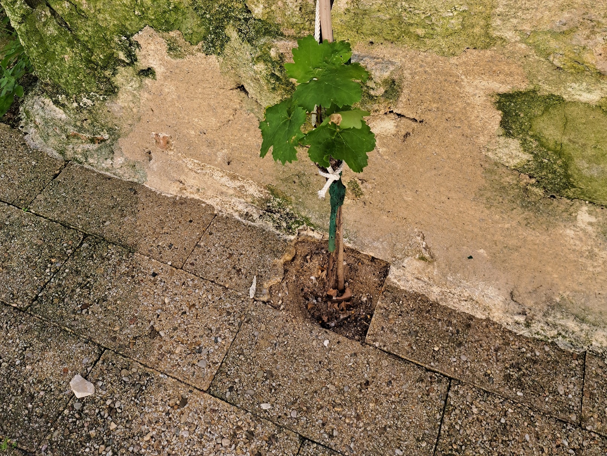
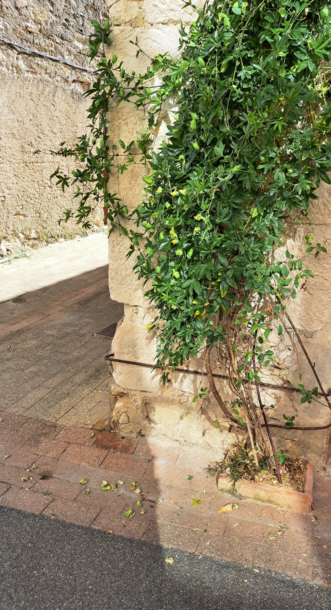

## Végétalisation de nos murs
{width=80%}

## Végétaliser les façades de Montpezat

- **Adapter le village à la répétition des canicules** 
- **Un programme simple, visible et participatif**

- *Programme communal d'aide à la création de fosses de plantation en pied de façade sur le domaine public*

- *La vision : un village transformé par ses habitants et entièrement végétalisé dans 5 ans*

---

## Pourquoi ce projet ?
**Répondre concrètement au changement climatique**

- Réduire la température des façades de **4 à 6 °C**.
- Améliorer le confort d'été des riverains et des passants.
- Permettre aux riverains, sous le contrôle de la mairie, de planter sur les trottoirs. (C'est interdit aujourd'hui).
- Agir : ne plus subir son environnement.

---

## Avant / Après

{width=80%}

---

## Un projet inspiré d'exemples réussis

 - Lille – "Verdissons nos murs"

 - Végétaliser Banyuls, c'est permis ! [(site)](https://www.banyuls-sur-mer.com/vegetaliser-banyuls-cest-permis/) 

 - Saint-Nazaire-d'Aude  : La commune fournit un « Kit de plantation » complet (plante locale, paillage, terreau et tuteur de protection) dès que la fosse est créée par la mairie. [(site)](https://www.saintnazairedaude.fr/amenager-notre-territoire/environnement/dispositif-permis-de-vegetaliser?utm_source=gemini)

---

## Organismes officiels 

- Le CAUE 82 (Conseil d’Architecture, d’Urbanisme et de l’Environnement) est un organisme investi d’une mission d’intérêt public.

- Il fournit un certain nombre de ressources pour ce type de projet.

- [caue-occitanie :](https://www.les-caue-occitanie.fr/dossier-thematique/dossier-permis-de-vegetaliser-les-documents) dossier permis de végétaliser

---

## Un partenariat simple entre la commune et les riverains
**Un dispositif communal de végétalisation des façades**

- Aide de la mairie pour la mise en place de fosses sur le domaine public.
- Conseil technique sur le choix de la plante.
- Éventuellement, fourniture du végétal à planter.
- Engagement du riverain pour l'entretien, la taille et l'arrosage.
- Phase pilote avant évaluation puis éventuellement généralisation.

---

## Phase pilote : 50 participants
**Évaluer la faisabilité**

- Faire connaître le projet.
- Identifier les difficultés rencontrées.
- Évaluer les coûts et les ressources nécessaires.
---

## Fosse de plantation en bordure de rue
{width=80%}

---

## Un projet simple, compréhensible par tous
- Le principe du programme sera décrit dans le bulletin municipal, avec des contrats ou chartes à remplir.
- Les habitants intéressés renvoient le contrat signé à la mairie.
- Un rendez-vous est pris avec un représentant de la mairie : les positions des fosses sont marquées à la bombe sur le trottoir.
- Les services municipaux mettent en place les fosse et plantent éventuellement les végétaux choisis.

---

## Le « contrat » avec les riverains
**Un contrat entre la mairie et les bénéficiaires de cette offre, avec des tâches et engagements pour chacun**

## Tâches et engagements de la mairie

- Évaluer la faisabilité (proximité des réseaux souterrains, gêne éventuelle à la circulation).
- Prendre en charge les travaux sur la voirie.
- Donner un appui technique sur le choix des végétaux.
- Éventuellement planter le végétal (s'il est en stock).

## Tâches et engagements du riverain

- Choisir des végétaux adaptés.
- Planter et entretenir les végétaux.
- Respecter les règles de sécurité et d'accessibilité.

---

## Développement de la végétation en pied de façade
{width=80%}

---

## Risques juridiques et points de vigilance

- Sécurité des piétons et de la circulation.
- Réseaux enterrés et contraintes techniques.
- Remplacement éventuel des végétaux.
- Risques de non-respect des engagements du riverain.

---

## Coût pris en charge par la mairie
**Un investissement ciblé et maîtrisé**

- La commune supporte le coût de la plantation.
- Le budget couvre la création des fosses et les petits travaux associés.
- Les habitants prennent en charge l'entretien (arrosage et taille).

---

## Communication vers les habitants
**Donner envie de participer**

- Annonce dans le bulletin municipal et IntraMuros.
- Appel à volontaires.
- Contrat ou convention simple, disponible dans le bulletin municipal, à retourner à la mairie ou en ligne.
- Mise en avant des bénéfices pour le village.

---

## Suivi et évaluation
**Mesurer simplement les résultats**

### Indicateurs proposés
- Nombre de volontaires.
- Nombre de fosses créées.
- Taux d'échec (pas d'entretien).
- Satisfaction des habitants.

---

## Ce que le conseil municipal doit approuver

- Le principe du programme.
- La phase pilote avec l'objectif de **50 conventions**.
- La prise en charge par la mairie du coût des fosses et de certains végétaux.
- Le cadre du contrat.
- L'ouverture de l'appel à volontaires.
- L'inscription du dispositif dans la politique locale de transition écologique.

---

## Conclusion
**Un projet simple, utile et fédérateur**

- Ce programme permet d'agir vite, à coût maîtrisé, avec les habitants, pour adapter le village aux canicules.

- Les vrais bénéfices apparaîtront 2 ou 3 ans après le lancement, le temps que les végétaux poussent.

- Un facteur clé de succès : Le portage et la mobilisation des élus.

---

## Avant / Après

{width=80%}

---

## A développer

- Zone pavillonnaire : végétaliser les bords de route.

- Relations et contacts avec ABF et autres organismes officiels (CAUE 82).

- Liste des végétaux conseillés et des végétaux déconseillés.

- Planning : Viser un déploiement début 2027 ( Publication Janvier 2027 dans le bulletin municipal;  décision Conseil Municipal fin 2026) 

---

## A développer (suite)

- Aides au financement : "Le Fonds vert" (État) ," Agences de l'Eau", "Ma Solution pour le Climat" (Région)

- Doctrine municipale de végétalisation des espaces publics ( végétalisation vs  embellissement )

- S'appuyer sur des associations (Jardin partagés) pour une aide (Fourniture des végétaux ? plantation ?)

